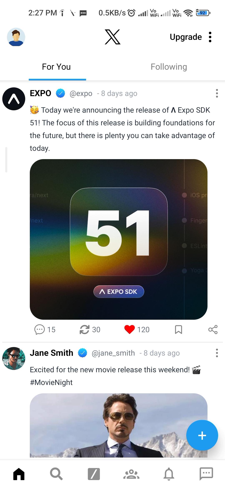

# X App

A mobile application built using React Native and Expo .

## Features

- Responsive UI designed for both iOS and Android
- Integrated navigation with React Navigation
- Animations using `react-native-reanimated`
- Styled with Tailwind CSS for consistent design
- Expo for simplified development, testing, and deployment

## Screenshot
<p align="center">

</p>

## Technologies Used

- **React Native**: Cross-platform mobile development
- **Expo**: Toolchain for React Native apps
- **Tailwind CSS**: Utility-first CSS framework for styling
- **React Navigation**: For app navigation
- **react-native-reanimated**: For animations

## Installation

1. Clone the repository:

```bash
git clone https://github.com/shrikantg199/X-APP-clone-UI
.git
```

2. Navigate to the project directory:

```bash
cd X-APP-clone-UI

```

3. Install dependencies:

```bash
npm install
```

4. Run the app on your local machine:

```bash
npm expo start
```


